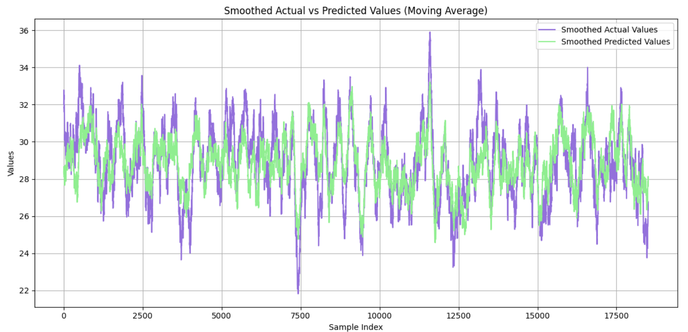

# An Overcrowded Gym

In this guided project, we will demonstrate how machine learning can help predict the best time to go to the gym. Specifically, we’ll train and build a **stochastic gradient descent linear regression model** to forecast how many people will be at the gym at a given day and time.

For this hypothetical scenario, we’ll use a dataset provided by **DataQuest** that contains historical information about how busy a campus gym has been. The dataset includes details such as the date, time, and other characteristics of each day.

View this project live on Google Colab [here](https://colab.research.google.com/drive/1RUrGx2ib0VEK-uWJYvYWbEZ9yN8FPTq0?usp=sharing).
